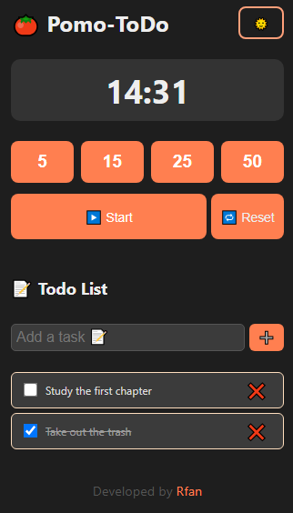

# 🍅 Pomo-ToDo

A minimal, productivity-focused **Pomodoro Timer + To-Do List** Chrome Extension with light/dark mode. Stay focused, track tasks, and get things done — all in one simple interface.

 

---

## 🚀 Features

- ⏱️ Pomodoro Timer with preset options (5, 15, 25, 50 minutes)  
- 📝 Built-in To-Do List with task adding & deletion  
- 🌙 Light/Dark Mode toggle  
- 🔁 Reset & Start controls  
- 📱 Responsive design (mobile-friendly)  
- 🔌 Works as a Chrome Extension (popup)  

---

## 📦 Installation

1. Clone or download this repository:
   ```bash
   git clone https://github.com/yourusername/pomo-todo-extension.git
   ```

### 2. Load the Extension in Chrome

1. Open **Chrome** and navigate to `chrome://extensions/`
2. Enable **Developer Mode** (toggle in the top right corner)
3. Click on **"Load unpacked"**
4. Select the folder where you extracted the extension

---

## 🌙 Features

- 🕒 Pomodoro Timer (Customizable: 5, 15, 25, 50 minutes)
- ✅ To-Do List with add/remove functionality
- 🌗 Light/Dark Mode toggle with smooth transition
- 🔄 Reset and Start buttons for timer control
- 🔔 Sound alert on timer completion
- ⚡ Instant load (no external libraries)

---

## 📁 Project Structure
```
Pomo-ToDo/
│
├── preview/
│   ├── dark.png
|   └── light.png
│
├── icons/
│   └── icon128.png
│
├── popup.html
├── popup.css
├── popup.js
├── background.js
├── manifest.json
└── README.md
```

---

## 🛠️ Tech Stack

- HTML
- CSS
- JavaScript

---

Feel free to contribute or fork the project.


